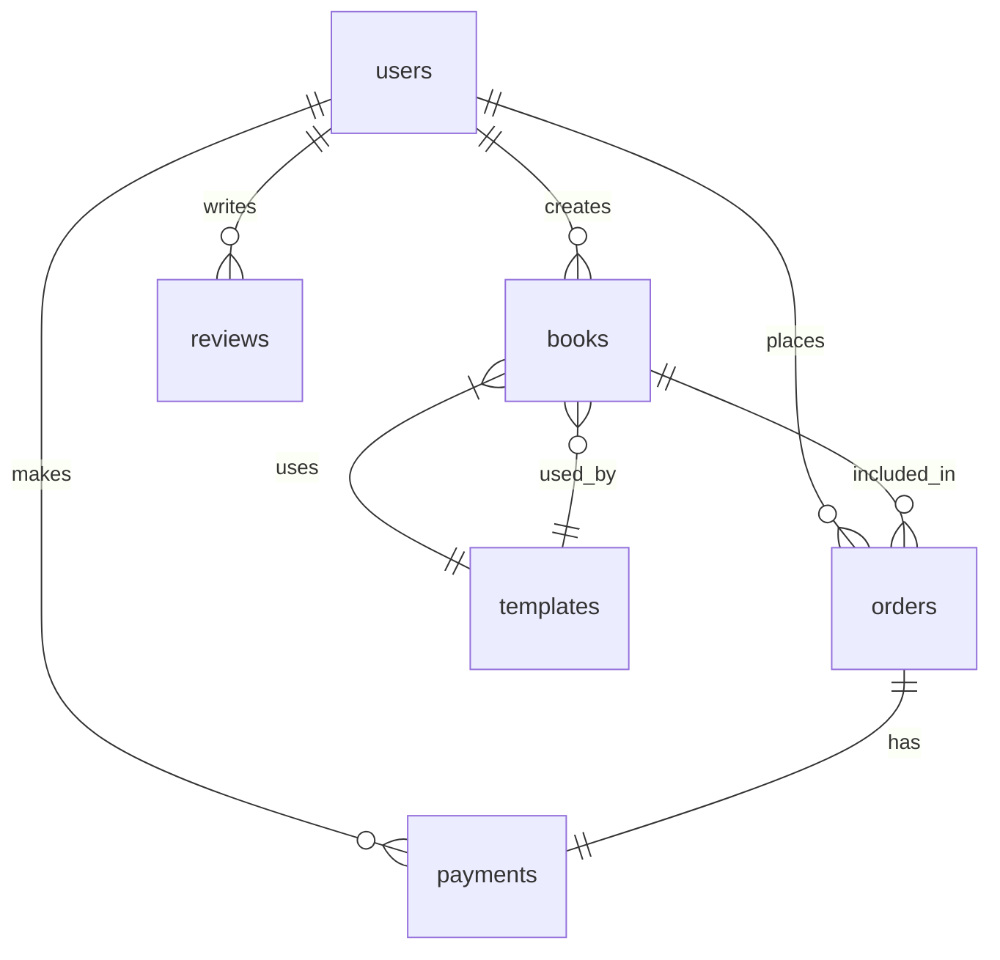

# Database Schema

This document details the database schema of Sal's Memory Maker, including tables, relationships, and indexes.

## Overview

The application uses PostgreSQL as its primary database, with the following main entities:
- Users
- Books
- Payments
- Templates
- Orders
- Reviews

## Schema Diagram



## Tables

### Users

```sql
CREATE TABLE users (
    id UUID PRIMARY KEY DEFAULT gen_random_uuid(),
    email VARCHAR(255) UNIQUE NOT NULL,
    hashed_password VARCHAR(255) NOT NULL,
    first_name VARCHAR(100),
    last_name VARCHAR(100),
    is_active BOOLEAN DEFAULT true,
    is_superuser BOOLEAN DEFAULT false,
    created_at TIMESTAMP WITH TIME ZONE DEFAULT CURRENT_TIMESTAMP,
    updated_at TIMESTAMP WITH TIME ZONE DEFAULT CURRENT_TIMESTAMP
);

CREATE INDEX idx_users_email ON users(email);
CREATE INDEX idx_users_created_at ON users(created_at);
```

### Books

```sql
CREATE TABLE books (
    id UUID PRIMARY KEY DEFAULT gen_random_uuid(),
    user_id UUID NOT NULL REFERENCES users(id) ON DELETE CASCADE,
    template_id UUID NOT NULL REFERENCES templates(id),
    title VARCHAR(255) NOT NULL,
    description TEXT,
    content JSONB NOT NULL,
    cover_image_url VARCHAR(255),
    status VARCHAR(50) NOT NULL DEFAULT 'draft',
    is_published BOOLEAN DEFAULT false,
    created_at TIMESTAMP WITH TIME ZONE DEFAULT CURRENT_TIMESTAMP,
    updated_at TIMESTAMP WITH TIME ZONE DEFAULT CURRENT_TIMESTAMP
);

CREATE INDEX idx_books_user_id ON books(user_id);
CREATE INDEX idx_books_template_id ON books(template_id);
CREATE INDEX idx_books_status ON books(status);
CREATE INDEX idx_books_created_at ON books(created_at);
```

### Templates

```sql
CREATE TABLE templates (
    id UUID PRIMARY KEY DEFAULT gen_random_uuid(),
    name VARCHAR(255) NOT NULL,
    description TEXT,
    preview_image_url VARCHAR(255),
    content_structure JSONB NOT NULL,
    is_active BOOLEAN DEFAULT true,
    price DECIMAL(10,2) NOT NULL,
    created_at TIMESTAMP WITH TIME ZONE DEFAULT CURRENT_TIMESTAMP,
    updated_at TIMESTAMP WITH TIME ZONE DEFAULT CURRENT_TIMESTAMP
);

CREATE INDEX idx_templates_name ON templates(name);
CREATE INDEX idx_templates_is_active ON templates(is_active);
```

### Payments

```sql
CREATE TABLE payments (
    id UUID PRIMARY KEY DEFAULT gen_random_uuid(),
    user_id UUID NOT NULL REFERENCES users(id) ON DELETE CASCADE,
    order_id UUID NOT NULL REFERENCES orders(id),
    amount DECIMAL(10,2) NOT NULL,
    currency VARCHAR(3) NOT NULL DEFAULT 'USD',
    status VARCHAR(50) NOT NULL,
    payment_method VARCHAR(50) NOT NULL,
    stripe_payment_id VARCHAR(255),
    created_at TIMESTAMP WITH TIME ZONE DEFAULT CURRENT_TIMESTAMP,
    updated_at TIMESTAMP WITH TIME ZONE DEFAULT CURRENT_TIMESTAMP
);

CREATE INDEX idx_payments_user_id ON payments(user_id);
CREATE INDEX idx_payments_order_id ON payments(order_id);
CREATE INDEX idx_payments_status ON payments(status);
CREATE INDEX idx_payments_created_at ON payments(created_at);
```

### Orders

```sql
CREATE TABLE orders (
    id UUID PRIMARY KEY DEFAULT gen_random_uuid(),
    user_id UUID NOT NULL REFERENCES users(id) ON DELETE CASCADE,
    book_id UUID NOT NULL REFERENCES books(id),
    total_amount DECIMAL(10,2) NOT NULL,
    status VARCHAR(50) NOT NULL DEFAULT 'pending',
    shipping_address JSONB,
    created_at TIMESTAMP WITH TIME ZONE DEFAULT CURRENT_TIMESTAMP,
    updated_at TIMESTAMP WITH TIME ZONE DEFAULT CURRENT_TIMESTAMP
);

CREATE INDEX idx_orders_user_id ON orders(user_id);
CREATE INDEX idx_orders_book_id ON orders(book_id);
CREATE INDEX idx_orders_status ON orders(status);
CREATE INDEX idx_orders_created_at ON orders(created_at);
```

### Reviews

```sql
CREATE TABLE reviews (
    id UUID PRIMARY KEY DEFAULT gen_random_uuid(),
    user_id UUID NOT NULL REFERENCES users(id) ON DELETE CASCADE,
    book_id UUID NOT NULL REFERENCES books(id) ON DELETE CASCADE,
    rating INTEGER NOT NULL CHECK (rating >= 1 AND rating <= 5),
    comment TEXT,
    created_at TIMESTAMP WITH TIME ZONE DEFAULT CURRENT_TIMESTAMP,
    updated_at TIMESTAMP WITH TIME ZONE DEFAULT CURRENT_TIMESTAMP
);

CREATE INDEX idx_reviews_user_id ON reviews(user_id);
CREATE INDEX idx_reviews_book_id ON reviews(book_id);
CREATE INDEX idx_reviews_rating ON reviews(rating);
```

## Relationships

### One-to-Many Relationships

1. **User to Books**
   - A user can create multiple books
   - Each book belongs to one user
   - Foreign key: `books.user_id` references `users.id`

2. **User to Payments**
   - A user can make multiple payments
   - Each payment belongs to one user
   - Foreign key: `payments.user_id` references `users.id`

3. **User to Orders**
   - A user can place multiple orders
   - Each order belongs to one user
   - Foreign key: `orders.user_id` references `users.id`

4. **User to Reviews**
   - A user can write multiple reviews
   - Each review belongs to one user
   - Foreign key: `reviews.user_id` references `users.id`

### Many-to-One Relationships

1. **Books to Template**
   - Multiple books can use the same template
   - Each book uses one template
   - Foreign key: `books.template_id` references `templates.id`

2. **Orders to Book**
   - Multiple orders can be for the same book
   - Each order is for one book
   - Foreign key: `orders.book_id` references `books.id`

### One-to-One Relationships

1. **Order to Payment**
   - Each order has one payment
   - Each payment belongs to one order
   - Foreign key: `payments.order_id` references `orders.id`

## Indexes

### Primary Indexes
- All tables have a UUID primary key
- Indexes are automatically created for primary keys

### Foreign Key Indexes
- `books.user_id`
- `books.template_id`
- `payments.user_id`
- `payments.order_id`
- `orders.user_id`
- `orders.book_id`
- `reviews.user_id`
- `reviews.book_id`

### Performance Indexes
- `users.email`
- `users.created_at`
- `books.status`
- `books.created_at`
- `templates.name`
- `templates.is_active`
- `payments.status`
- `payments.created_at`
- `orders.status`
- `orders.created_at`
- `reviews.rating`

## Constraints

### Not Null Constraints
- `users.email`
- `users.hashed_password`
- `books.user_id`
- `books.template_id`
- `books.title`
- `books.content`
- `templates.name`
- `templates.content_structure`
- `templates.price`
- `payments.user_id`
- `payments.order_id`
- `payments.amount`
- `payments.status`
- `payments.payment_method`
- `orders.user_id`
- `orders.book_id`
- `orders.total_amount`
- `reviews.user_id`
- `reviews.book_id`
- `reviews.rating`

### Unique Constraints
- `users.email`

### Check Constraints
- `reviews.rating` (must be between 1 and 5)

## Data Types

### UUID
- Used for primary keys and foreign keys
- Generated using `gen_random_uuid()`

### VARCHAR
- Used for short text fields
- Lengths vary based on content type

### TEXT
- Used for long text fields
- No length limit

### JSONB
- Used for structured data
- Supports indexing and querying

### TIMESTAMP WITH TIME ZONE
- Used for date/time fields
- Includes timezone information

### DECIMAL
- Used for monetary values
- Precision: 10, Scale: 2

### BOOLEAN
- Used for true/false flags
- Default values specified where appropriate

## Triggers

### Updated At Trigger

```sql
CREATE OR REPLACE FUNCTION update_updated_at_column()
RETURNS TRIGGER AS $$
BEGIN
    NEW.updated_at = CURRENT_TIMESTAMP;
    RETURN NEW;
END;
$$ language 'plpgsql';

CREATE TRIGGER update_users_updated_at
    BEFORE UPDATE ON users
    FOR EACH ROW
    EXECUTE FUNCTION update_updated_at_column();

-- Similar triggers for other tables
```

## Views

### Active Books View

```sql
CREATE VIEW active_books AS
SELECT b.*, u.email as user_email, t.name as template_name
FROM books b
JOIN users u ON b.user_id = u.id
JOIN templates t ON b.template_id = t.id
WHERE b.is_published = true
AND b.status = 'completed';
```

### User Statistics View

```sql
CREATE VIEW user_statistics AS
SELECT 
    u.id as user_id,
    u.email,
    COUNT(b.id) as total_books,
    COUNT(CASE WHEN b.is_published = true THEN 1 END) as published_books,
    COUNT(o.id) as total_orders,
    SUM(o.total_amount) as total_spent
FROM users u
LEFT JOIN books b ON u.id = b.user_id
LEFT JOIN orders o ON u.id = o.user_id
GROUP BY u.id, u.email;
```

## Backup and Recovery

### Backup Strategy
1. Daily full backups
2. Continuous WAL archiving
3. Point-in-time recovery capability

### Recovery Procedures
1. Full database restore
2. Point-in-time recovery
3. Individual table recovery

## Performance Optimization

### Query Optimization
1. Use of appropriate indexes
2. Regular VACUUM and ANALYZE
3. Query plan analysis
4. Connection pooling

### Maintenance
1. Regular index maintenance
2. Statistics updates
3. Table partitioning (if needed)
4. Regular vacuuming

For more detailed information about specific database operations or implementation details, please refer to the respective documentation sections or the source code. 